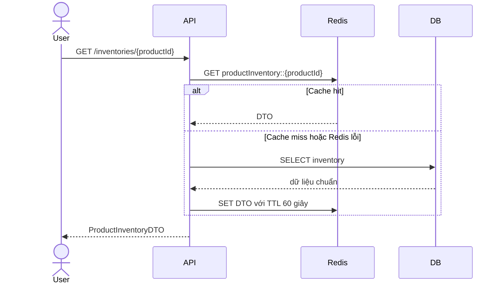
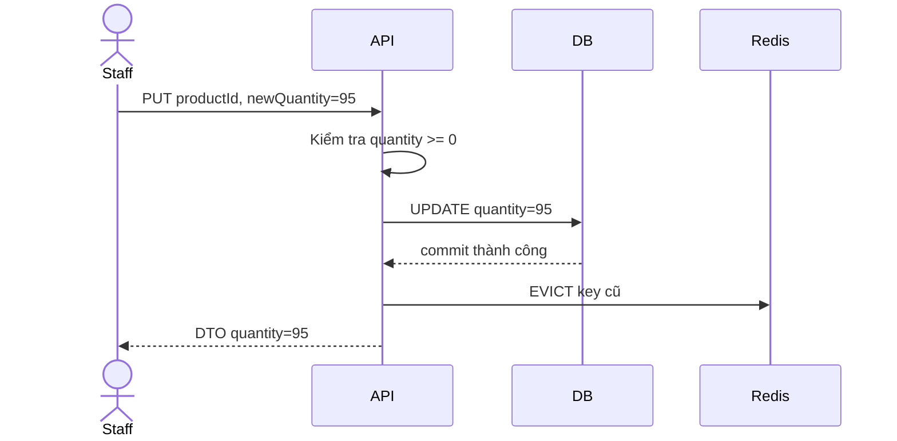

# SS16_HW03 - Quản lý tồn kho với Cache-Aside Pattern


## 1. Bối cảnh và mục tiêu

Inventory Service dùng H2/RDBMS làm **nguồn dữ liệu chính** và Redis làm bộ nhớ đệm phân tán. Cache chỉ giúp tăng tốc đọc, không được xem là nơi lưu dữ liệu chuẩn. Thiết kế phải bảo đảm cập nhật tồn kho không bị mất khi Redis gián đoạn, số lượng không thể âm và dữ liệu cache cũ chỉ tồn tại trong thời gian có giới hạn.

Input/output:

- Đọc: `productId` phải khác null/rỗng; trả `ProductInventoryDTO(productId, quantity)`.
- Ghi: `productId` hợp lệ và `newQuantity >= 0`; trả DTO sau khi DB cập nhật.

## 2. Luồng đọc theo Cache-Aside



`@Cacheable` thực hiện kiểm tra cache trước khi gọi method. Khi cache hit, thân method không chạy. Khi cache miss, method đọc DB và kết quả được nạp vào Redis. Thuộc tính `sync=true` hạn chế nhiều request trong cùng instance cùng truy vấn DB cho một key khi cache vừa hết hạn.

Nếu Redis GET ném exception, `CacheErrorHandler` ghi cảnh báo nhưng không ném lỗi ra controller. Spring tiếp tục gọi method, vì vậy người dùng vẫn nhận dữ liệu từ DB. Nếu PUT cache lỗi, response DB vẫn được trả bình thường.

## 3. Luồng ghi theo Cache-Aside



`@CacheEvict(afterInvocation=true)` chỉ xóa cache sau khi method cập nhật DB hoàn tất thành công. Nếu DB lỗi, method ném exception và cache hiện tại không bị xóa vô ích. Sau khi evict, lần đọc kế tiếp miss cache, lấy 95 từ DB rồi nạp lại Redis.

Thiết kế chọn **update DB rồi evict**, không ghi đồng thời DB và cache. Việc ghi hai nơi dễ sinh lỗi một nơi thành công, một nơi thất bại. Cache-Aside giữ DB là nguồn sự thật và cho phép cache tự phục hồi qua lần đọc sau.

## 4. Chặn số lượng âm

Có hai lớp bảo vệ:

1. DTO request dùng `@NotNull` và `@Min(0)`, vì vậy HTTP request `-10` trả `400 Bad Request`.
2. Service kiểm tra lại `newQuantity == null || newQuantity < 0`. Lớp này bảo vệ cả trường hợp service được gọi từ batch, message consumer hoặc code nội bộ không đi qua controller.

Việc kiểm tra xảy ra trước `repository.findById()` và `save()`, nên dữ liệu không hợp lệ không thể chạm database và không kích hoạt evict cache.

## 5. Khi Redis bị ngắt kết nối

### 5.1 Lỗi khi đọc

`handleCacheGetError` ghi log và bỏ qua lỗi. Cache interceptor xem như cache miss và chạy method đọc DB. Đây là cơ chế graceful degradation: response có thể chậm hơn nhưng chức năng vẫn hoạt động.

Không nên tự `try-catch Redis` trong business service vì service không cần biết công nghệ cache. `CacheErrorHandler` giữ phần xử lý sự cố ở tầng hạ tầng.

### 5.2 Lỗi khi xóa cache

DB đã cập nhật thành công nhưng Redis EVICT có thể lỗi. Nếu cache cũ còn tồn tại, người dùng có thể đọc giá trị cũ trong một khoảng ngắn. Các biện pháp trong bài:

- Mỗi entry có TTL 60 giây, nên stale cache không tồn tại vô thời hạn.
- `handleCacheEvictError` ghi log mức ERROR để hệ thống giám sát cảnh báo.
- Lần cache hết hạn tiếp theo sẽ tự đọc lại DB và sửa dữ liệu.

Trong production có thể bổ sung transactional outbox hoặc hàng đợi retry cho sự kiện `InventoryChanged`, consumer sẽ evict key sau khi Redis phục hồi. Đây là bảo đảm mạnh hơn TTL nhưng làm hệ thống phức tạp hơn.

## 6. Cấu trúc mã nguồn

- `InventoryService`: chứa `@Cacheable`, `@CacheEvict`, validation và transaction DB.
- `RedisCacheConfig`: Redis Cache Manager, JSON serializer, TTL và `CacheErrorHandler`.
- `ProductInventoryRepository`: thao tác RDBMS qua Spring Data JPA.
- `InventoryController`: API đọc/cập nhật.
- `ApiExceptionHandler`: chuẩn hóa lỗi 400/404.
- `InventoryServiceTest`: kiểm tra dữ liệu âm, cập nhật và cache-miss path.

## 7. Cài đặt và chạy

Yêu cầu Java 17 và Docker:

```bash
docker compose up -d
./gradlew clean test
./gradlew bootRun
```

Chạy kịch bản:

```bash
chmod +x demo/test-cache-aside.sh
./demo/test-cache-aside.sh
```

Dữ liệu mẫu `IPHONE-15 = 100` được tạo khi ứng dụng khởi động lần đầu. Database H2 lưu xuống thư mục `data/`, nên dữ liệu vẫn còn sau khi restart.

## 8. Kiểm tra fallback Redis

1. Đọc `IPHONE-15` khi Redis đang chạy để tạo cache.
2. Tắt Redis: `docker compose stop redis`.
3. Gọi GET lần nữa. API vẫn trả dữ liệu từ H2 và log cảnh báo Redis GET.
4. Cập nhật quantity khi Redis tắt. DB vẫn commit; lỗi EVICT được ghi log.
5. Khởi động Redis: `docker compose start redis`. Cache được nạp lại từ DB ở lần đọc sau.

## 9. Đánh đổi

Cache-Aside không cung cấp strong consistency tuyệt đối giữa DB và cache. Cửa sổ stale có thể xuất hiện khi evict lỗi hoặc giữa lúc DB commit và cache xóa. Với tồn kho nhạy cảm, bước trừ tồn kho khi đặt hàng vẫn phải dùng transaction/atomic update tại DB; cache phù hợp cho API hiển thị và tra cứu nhanh, không nên là cơ sở duy nhất để quyết định bán vượt tồn.
